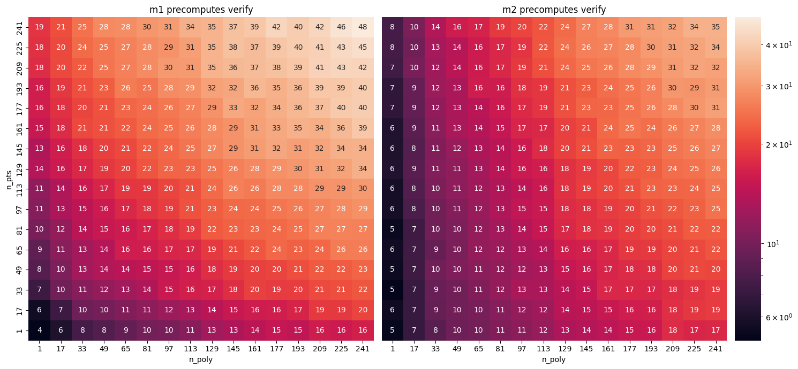

# Overview

The Polynomial Multiproof (PMP) scheme is a polynomial commitment scheme that allows for efficiently creating/verifying opening proofs for multiple polynomials at multiple points. 
Notably, opening speed is mostly _not dependent on the number of polynomials/points_ opened to.
Verification scales with the number of points/polynomials, but remains fast.
Two methods are provided, which trade opening speed for verification speed. 

For some sample numbers, here are times opening/verifying degree 255 polynomials using BLS12-381[^1]:

|  | Method 1 | Method 2|
|--|----------|---------|
|Opening time | 12-14ms | 26-28ms |
|Verification time | 4-48ms | 5-35ms |

This specification outlines implementation requirements for the polynomial multiproof (PMP) scheme.
This builds on previous methods such as KZG10[^2], and is heavily inspired by BDFG21[^3]. 
It should be seen as choosing a special case of BDFG21 which allows for significant optimizations that make the protocol more viable for use in applications like Data Availability.

The scheme consists of four methods:

1. `Setup` which sets up a structured reference string for the curve and does some 
2. `Commit` which commits to a polynomial
3. `M1Open/M2Open` which computes a single opening proof that a set of polynomials are equal to specific values at a set of points
4. `M1Verify/M2Verify` which verify an opening proof against commitments and evaluations

### Applications to Data Availability
Data availability systems can benefit greatly from PMP, since polynomial commitment-based DA systems are tremendously constrained by opening time.
Even with very fast KZG implementations, opening is too slow, and constrains the amount of data which can be processed through the system

> Opening to a degree 255 BLS12-381 scalar field polynomial takes at best ~3-6ms, which means opening to every cell of 256 of those polynomials will take >200s.

Because PMP allows many cells to be opened to at once, the data availability grid can be chunked into a smaller grid, allowing for a faster, more secure system, with far higher througput [^4].
This allows polynomial commitment-based DA systems scale up in size without taking more compute.

### Curve selection

The protocol depends on the selection of a pairing based curve. 
Attributes of an ideal curve for this protocol are, in order of importance,
1. Security
2. Fast G1 scalar multiplication
3. Large scalar field size
4. Fast G2 scalar multiplication
5. Small compressed G1 scalar size

BLS12-381 satisfies the first two critera well, and while other curves likely could satisfy more requirements, they are currently not as well audited. Hence BLS12-381 is a reasonable choice to start with.

The scheme given in BDFG21 is interactive, so Merlin transcripts are used to do the Fiat-Shamir transform.

Optimizations made from BDFG21 are outlined in [Optimizations](./a_optimizations.md)

[^1]: All times are with a Xeon E5-2676 v3 @ 2.40GHz vCPU on AWS

[^2]: [KZG10 Paper](https://www.iacr.org/archive/asiacrypt2010/6477178/6477178.pdf)

[^3]: [BDFG21 Paper](https://eprint.iacr.org/2020/081.pdf)

[^4]: More FFTs are required as data size increases, but these are dwarfed by opening times. Additionally, exactly how the chunking is done has nuanced security implications in different scenarios. 
